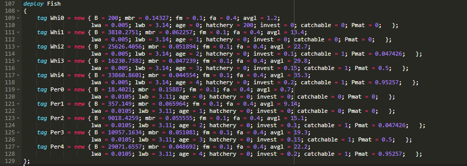

Introduction to ATNS
=======================

ATNS is a new kind of object oriented programming language based on graphs, i.e. nodes and links.
In the following, we go through basic definitions of models, and how to change them.

Guilds: Producers and Consumers
--------------------------------

Above, we have a node definition with name Guild. This is the base type for all entities.

.. note::
   In ATNS, the underscore is relevant. If a variable is presented with :code:`_i` in a class Guild, it means it is defined for members of the Guild.
   ATNS performs automatic broadcasting of expressions, so that the end result looks like typical mathematical definitions. 
   In similar manner, variables without underscore are global to the node.
 
.. note::
   There is basic inheritance properties, by using :code:`inherits` keyword, one lets producers to have also the biomass variable :code:`B_i`.

