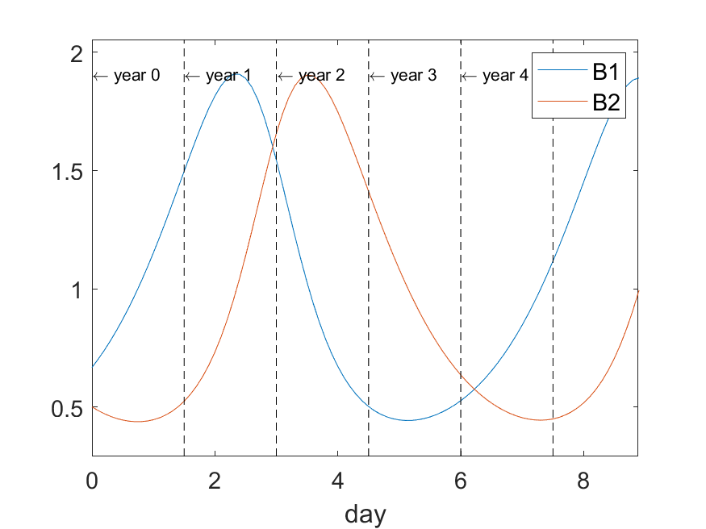

.. _odeparams:

Configuring simulation paramaters
=================================

ATNS allows to simulate periodically discontinuous ordinary differential equations.

ATNS structure is internally divided into two epochs, minor and major. Minor epoch specifyes the time interval where simulation results are to be stored (typically day), 
and major epoch specifyes discontinuous period, typically year (growth season).

+---------------+------------+----------------+-------------------------------------------------------------------------------------------+
| Parameter     | .model file| at Matlab      | Description                                                                               |
+===============+============+================+===========================================================================================+
| Day length    | daylength  | day_length     | The length of the day in time units. Thus, the time unit is '1/the numerical value' days. |
+---------------+------------+----------------+-------------------------------------------------------------------------------------------+
| Steps/day     | stepsperday| steps_per_day  | This determines the timestep, dt = day length / (steps/day).                              +
+---------------+------------+----------------+-------------------------------------------------------------------------------------------+
| Days/year     | daysperday | days_per_year  | Number of days in growth season.                                                          +
+---------------+------------+----------------+-------------------------------------------------------------------------------------------+
| Years         | years      | years          | Number of years to simulate                                                               +
+---------------+------------+----------------+-------------------------------------------------------------------------------------------+
| Name of day   | N/A        | day_name       | If day length is not 1, it makes no longer sense to call it a day. Use this to rename it  +
+---------------+------------+----------------+-------------------------------------------------------------------------------------------+
| Name of year  | N/A        | year_name      | Rename year, eg. growth season.                                                           +
+---------------+------------+----------------+-------------------------------------------------------------------------------------------+

Simulation parameters in model-code
------------------------------------

We take the previous Lotka--Volterra model, used in section :ref:`atnssimple` and add simulation parameters to it. We save it to a file :code:`lvsim.model`. 
You may also download it directly :download:`here <lvsim.model>`.

.. literalinclude:: lvsim.model

.. note::
   The spesification of standard day, year, growthseason is given in an include file, and thus it suffices to include following code.
   include "dayandyear.inc"

We may now run the code, again, by writing :code:`results = atns('lv.model')`. Plotting the results, 

.. code::
    
    results.plot();

We note that the variables do not follow any periodic patterns, since we do not have any periodic interference affecting the system. This will be addressed later.

Simulation parameter with Matlab
--------------------------------

Sometimes it will be easier to configure system at Matlab script-level. To that end, the :code:`atns`-function takes also simulation parameters after the script file. 
Note that any parameters set in model will override these parameters.

.. code::

   >> results = atns('lv.model','steps_per_day', 10, ...
                                'day_length', 1, ...
                                'days_per_year', 90, ...
                                'years', 7, ...
                                'day_name', 'day', ...
                                'year_name', 'year');

Next step
----------------

You may now simulate a first real system, Lake Constance in section :ref:`lakeconstance`.

