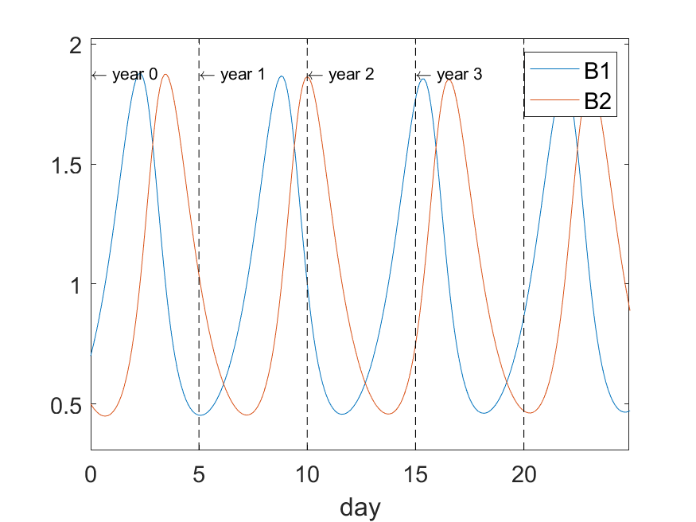
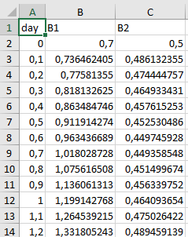

.. _atnssimple:

Using ATNS directy via Matlab
=============================

In this tutorial, you will setup your first model.

Sample code
---------------------------

We will build a simple Lotka--Volterra model, and save it to a file :code:`lv.model`. You may also download it directly :download:`here <lv.model>`.

.. literalinclude:: lv.model

.. note::
   When saving a file with .model extension, be sure to select :code:`all files (*.*)` in the Matlab save dialog. Otherwise, Matlab will want to add the .m suffix automatically.

Running the model
---------------------------

Let's now run the code, by writing :code:`results = atns('lv.model')`

.. code::

   >> results = atns('lv.model')

This returns the results object, which may further be utilized in plotting and analyzing the results.

Simple result analysis
---------------------------------------

In folder :code:`demonstrations\lv`, there is the simplest analysis script, which simply plots the data, and subsequently exports it to txt and xlsx (Microsoft Excel) formats.

.. code::

    results = atns('lv.model','years',5,'days_per_year',50, 'steps_per_day',15,'day_length',0.1);
    results.plot();
    print('-dpng','lv.png');
    results.export('lv.txt');
    results.export('lv.xlsx');

.. note::
    We have set day length to 0.1 time units, so that we gather data more frequently for smooth daily plots. The time unit used in the simulation is thus 10 days.

.. note::
    Exporting to :code:`lv.txt` exports the yearly data. In addition, the export function creates also :code:`lv_daily.txt` which contains the daily data.

Here is an example of the excel output.

Next step
----------------

You may now learn to spesify simulation settings, already introduced above, such as simulation time in section :ref:`odeparams`.

